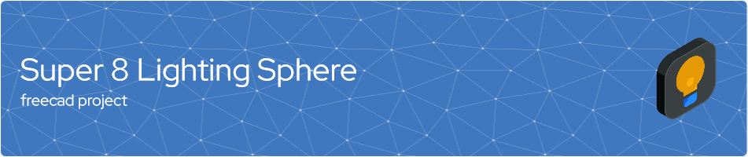

# Kinograph Lighting Sphere - FreeCAD Project 📐💡

The **Kinograph Lighting Sphere** is a parametric model designed in [FreeCAD](https://www.freecadweb.org/downloads.php), an open-source 3D parametric modeler. It aims to provide a comprehensive solution for kinograph lighting.

This project is based on an original design by [@cpixip](https://github.com/cpixip) and has been adjusted to be fully parametric. It has been updated to use current COB LED PCBs with a dimension of 13.5mm. You can view the original forum post [here](https://forums.kinograph.cc/t/v2-dev-milestone-3-lighting/1576/37?u=d_fens).

## Features 🌟

* **Fully Parametric**: All parameters are encapsulated in a spreadsheet, making modifications and customizations straightforward and intuitive.
* **Current COB LED PCB Compatibility**: The model now supports COB LED PCBs with a 13.5mm dimension.
* **Printable Parts**: The project consists of three printable parts:
  * Cooling part using a common 30mm fan 🌬️
  * Front part with super 8 gate and mounting holes 🎞️
  * Back part as holder for cooling part 🛠️

## Getting Started 🚀

1. Clone the repository or download the project files.
2. Open the project file in FreeCAD.

## Usage 💻

The model parameters can be modified by accessing the embedded spreadsheet in the FreeCAD project. After making your changes:

1. Save the project.
2. Re-compute the model (usually via a button in the toolbar or an option in one of the menus).

## Important Hints ⚠️

* **Chamfer and Fillet**: Due to inherent topology problems in FreeCAD, the last chamfer and fillet might break after making changes in the spreadsheet. It's a known issue and you will have to redo them manually after modifying parameters.
* **Airflow Check**: Ensure that there is proper airflow from the fan to the LED heatsink. This is critical for maintaining optimal operating temperature and preventing overheating.

## Feedback & Contributing 🤝

If you want to contribute to this project and make it better, your help is very welcome. Feel free to send your feedback via creating an issue in this repository.

## License 📜

This project is licensed under the terms of the MIT license. See [LICENSE](LICENSE) for more information.
